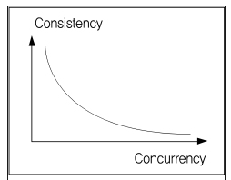

> MVCC의 개념을 이해하기 위해 동시성 제어(Concurrency Control)의 개념 사전이해가 필요해 보임.  
>- 동시성제어: DBMS가 다수의 사용자 사이에서 동시에 작용하는 다중 트랜잭션의 상호간섭 장용에서 DB를 보호하는 것.  
>- 일반적으로 동시성을 허용하면 일관성이 낮아지게 됨.  
>> 
  
>### 낙관적 동시성 제어  
>- 사용자들이 같은 데이터를 동시에 수정하지 않을 것이라고 가정  
>- 데이터를 읽는 시점에 Lock을 걸지 않는 대신 수정 시점에 값이 변경됐는지를 반드시 검사
>### 비관적 동시성 제어  
>- 사용자들이 같은 데이터를 동시에 수정할 것이라고 가정
>- 데이터를 읽는 시점에 Lock을 걸고, 트랜잭션이 완료될 때까지 이를 유지
>- SELECT 시점에 Lock을 거는 비관적 동시성 제어는 시스템의 동시성을 심각하게 떨어뜨릴 수 있어서 wait또는 nowait옵션과 함께 사용해야 함. 
>- Lock  
>  1번 트랜잭션이 각각의 락을 가져간 경우의 동작  
> *획득한 락을 해제하는 방법은 커밋, 롤백 밖에 없다.*
>    - 공유락(Shared Lock): 읽기 잠금
>      - 2번 트랜잭션이 데이터를 읽는 경우는 데이터가 일관되므로, 2버 트랜잭션이 또 다른 공유락을 가져가면서 동시에 처리함
>      - 2번 트랜잭션이 데이터를 쓰는 경우는 1번 트랜잭션과 데이터가 달라질 수 있으므로 1번 트랜잭션 종류까지 기다려야 함.
>    - 배타락(Exclusive Lock): 쓰기 잠금
>      - 2번 트랜잭션이 데이터를 읽는 경우, 1번 트랜잭션이 데이터를 변경할 수 있으므로 기다림
>      - 2번 트랜잭션이 데이터를 쓰는 경우에도, 1번 트랜잭션이 데이터를 변경할 수 있으므로 기다림  
> 
>- Locking 메커니즘의 문제
>    - 읽기 작업과 쓰기 작업이 서로 방해를 일으키기 때문에 동시성 문제가 발생
>    - 데이터 일관성에 문제가 생기는 경우도 있어서 Lock을 더 오래 유지하거나 테이블 레벨의 Lock을 사용해야 하고, 동시성 저하가 발생
>### *동시성 제어의 목표는 **실행되는 트랜잭션 수를 최대화** 화면서 **입력, 수정, 삭제, 검색 시 데이터의 무결성을 유지**하는데 있다.*  

### MVCC(Multi Version Concurrency Control)
- 동시 접근을 허용하는 데이터베이스에서 동시성을 제어하기 위해 사용하는 방법 중 하나
- 데이터에 접근하는 사용자는 접근한 시점에 데이터베이스의 *Snapshot*을 읽는다
- *Snapshot* 데이터에 대한 변경이 ***commit*** 될 때 까지의 변경사항은 다른 사용자가 볼 수 없다.
- 이후 사용자가 업데이트 하면 이전에 데이터를 덮어 씌우는게 아닌 새로운 버전의 데이터를 UNDO 영역에 생성(이전 버전의 데이터와 비교해서 변경된 내용을 기록)
- 일반적인 RDBMS보다 매우 빠르게 동작
- 사용하지 않는 데이터가 계속 쌓이게 되므로 데이터를 정리하는 시스템이 필요
- 데이터 버전이 충돌하면 애플리케이션 영역에서 문제를 해결해야 함.
- UNDO 블록 I/O, CR Copy 생성, CR 블록 캐싱 같은 부가적인 작업의 오버헤드가 발생
- 트랜잭션의 격리 수준에 따라 버퍼 풀의 변경된 데이터를 반환(READ_UNCOMMITTED)하거나, 변경되기 이전의 UNDO 로그 영역의 데이터를 반환(READ_COMMITED ↑)함.