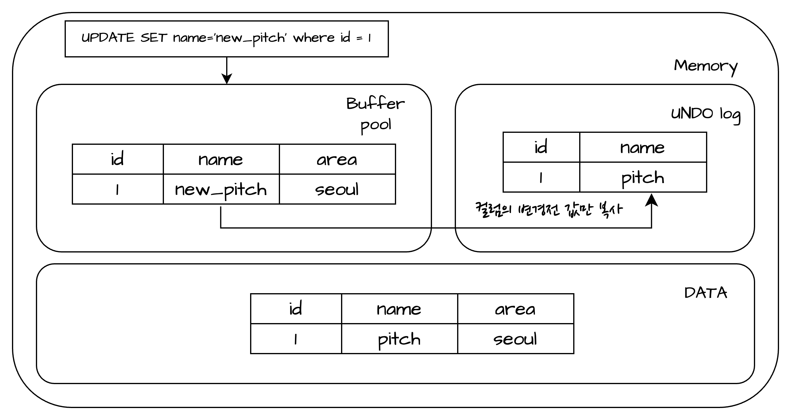

### UNDO 로그
- InnoDB 엔진은 트랜잭션과 격리 수준을 보장하기 위해 DML(INSERT, UPDATE, DELETE)로 변경 되기 이전 버전의 데이터를 별도로 백업하는데 백업된 데이터를 UNDO 로그라고 한다.
  - 트랜잭션 보장
	- 트랜잭션이 롤백되면 트랜잭션 도중 변경된 데이터를 변경 전 데잍어로 복구해야 하는데, 이 때 UNDO 로그에 백업해둔 이전 버전의 데이터를 이용해 복구한다.
  - 격리 수준 보장
	- 특정 커넥션에서 데이터를 변경하는 도중에 다른 커넥션에서 데이터를 조회하면 트랜잭션 격리 수준에 맞게 변경중인 레코드를 읽지 않고 UNDO 로그에 백업해둔 데이터를 읽어서 반환하기도 한다.
>UNDO 로그 동작방식
>
 
- UNDO TableSpace: UNDO로그가 저장되는 공간
	- 구조: 128개 이하의 롤백 세그먼트를 가지고 롤백 세그먼트는 1개 이상의 언두 슬롯을 가진다.
	- 하나의 롤백 세그먼트는 InnoDB의 페이지 크기를 16바이트로 나눈 값의 개수만큼 언두 슬롯을 가진다.
	> 최대 동시 트랜잭션 수
	> (InnoDB 페이지 크기) / 16 * (롤백 세그먼트 개수) * (언두 테이블스페이스 개수)  

### REDO 로그
- Write Query(INSERT, UPDATE, DELETE)에 해당하는 데이터의 변경을 모두 저장.
- 데이터 내구성을 보장하기 위해 사용하는 로그, 메모리 영역에 남아있는 데이터를 디스크 영역으로 옮겨지지 못한채 서버가 다운되는 현상이 발생하면 UNDO 로그와 같이 
데이터 복구에 사용된다.
- 동작순서  
    >1) 버퍼 풀에서 데이터 변경시 해당되는 페이지를 수정 후 Dirty 마크 표시  
    >2) 관련 REDO 로그 레코드를 메모리 상의 내부적인 log관련 memory(Double Write Buffer)에 저장
    >3) REDO 로그 레코드를 로그 버퍼로 이동
    >4) REDO 로그 레코드를 REDO 로그 파일에 Flush
    >5) 버퍼 풀 내의 변경된 Dirty 페이지에 대해 checkpoint를 수행하여 Tablespace에 저장
    >
 

### 로그 버퍼
- REDO 로그 파일에 기록될 데이터를 보유하는 메모리 영역
- `innodb_log_buffer_size` 파라미터로 설정(일반적으로 4MB ~ 16MB가 좋은크기라고 함)
- 로그 버퍼크기를 크게 조정하면 트랜잭션을 커밋 하기 전에 디스크에 로그를 쓰지않아도 큰 트랜잭션을 실행할수 있게 되고, 또한 많은 행을 업데이트, 삽입, 삭제하는 트랜잭션이 있는 경우 로그버퍼를 크게조정하면 DISK I/O 가 절약됨.
출처: https://myinfrabox.tistory.com/259 [MyInfraBox:티스토리]