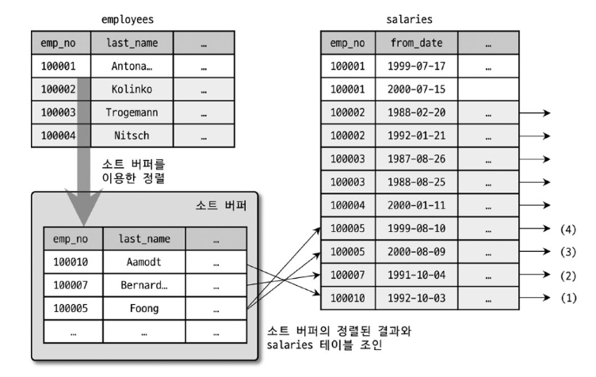
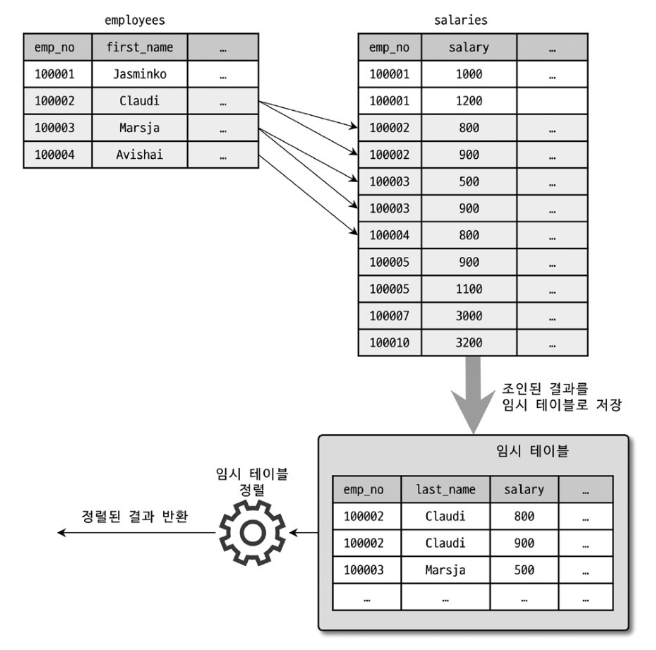

## Order by 처리
- 정렬을 처리하는 방법은 인덱스를 이용하는 방법과 쿼리가 실행될 때 "Filesort"라는 별도의 처리를 이용하는 방법으로 나눌 수 있다.  

||인덱스 이용|Filesort이용|  
|---|---|---|  
|장점|INSERT, UPDATE, DELETE 쿼리가 실행 될 때 이미 인덱스가 정렬돼 있어 순서대로 읽기만 하면 되므로 매우 빠르다 |인덱스를 생성하지 않아도 되므로 인덱스를 이용할 때의 단점이 장점으로 바뀜.  정렬해야 할 레코드가 많지 않으면 메모리에서 Filesort가 처리되므로 충분히 빠르다|  
|단점|INSERT, UPDATE, DELETE 작업 시 부가적인 인덱스 추가/삭제 작업이 필요하므로 느리다. 인덱스 때문에 디스크 공간이 더 많이 필요하다. 인덱스의 개수가 늘어날수록 InnoDB의 버퍼 풀을 위한 메모리가 많이 필요하다| 정렬 작업이 쿼리 실행 시 처리되므로 레코드 대상건수가 많아질수록 쿼리의 응답 속도가 느리다|

>모든 정렬을 인덱스를 이용하도록 튜능하기가 힘든 이유
> - 정렬 기준이 너무 많아서 요건별로 모두 인덱스를 생성하는 것이 불가능한 경우
> - GROUP BY의 결과 또는 DISTINCT 같은 처리의 결과를 정렬해야 하는 경우
> - UNION의 결과와 같이 임시 테이블의 결과를 다시 정렬해야 하는 경우
> - 랜덤하게 결과 레코드를 가져와야 하는 경우

- MySQL 서버에서 실행 계획의 `Extra`컬럼에 `Using filesor`메세지가 표시되는지의 여부로 인덱스를 사용하지 않고 별도의 정렬 처리를 수행했는지 알 수 있다.

### 소트 버퍼
- 정렬을 수행하기 위해 별도의 할당받은 메모리 공간
- 정렬이 필요한 경우에만 할당됨.
- 버퍼의 크기는 정렬해야 할 레코드의 크기에 따라 가변적으로 증가하지만 `sort_buffer_size` 변수로 최대 사용 가능한 소트 버퍼의 공간을 설정할 수 있음.
- 메모리 공간은 쿼리의 실행이 완료되면 즉시 시스템으로 반납됨.
- 정렬해야 할 레코드의 건수가 소트 버퍼로 할당된 공간보다 큰 경우
  - MySQL은 정렬해야 할 레코드를 여러 조각으로 나눠서 처리하는데, 이 과정에서 임시저장을 위해 디스크를 사용한다.
  - 소트 버퍼에서 정렬을 수행하고 그 결과를 임시로 디스크에 기록해 둔다.
  - 다음 레코드를 가져와서 다시 정렬해서 반복적으로 디스크에 임시 저장하고 각 버퍼 크기만큼 정렬된 레코드를 다시 병합하면서 정렬을 수행한다.
  - 위 작업들 모두 디스크의 쓰기와 읽기를 유발하고, 레코드 건수가 많을 수록 반복 작업의 횟수가 증가함.
  - 소트 버퍼를 크게 설정하더라도 실제 벤치마크 결과로는 유의미한 차이가 없음

### 정렬 알고리즘
- MySQL 서버의 정렬 방식
  - <sort_key, rowid>: 정렬 키와 레코드의 로우 아이디(Row ID)만 가져와서 정렬하는 방식(투 패스)
  - <sort_key, additional_fields>: 정렬 키와 레코드 전체를 가져와서 정렬하는 방식으로, 레코드의 컬럼들은 고정 사이즈로 메모리 저장(싱글 패스)
  - <sort_key, packed_additional_fields>: 정렬 키와 레코드 전체를 가져와서 정렬하는 방식으로, 레코드의 컬럼들은 가변 사이즈로 메모리 저장(싱글 패스)

- 싱글 패스 정렬 방식
  - 정렬에 필요하지 않는 컬럼까지 전부 읽어서 소트 버퍼에 담고 정렬을 수행
  - 정렬이 완료되면 정렬 버퍼의 내용을 그대로 클라이언트로 넘겨줌

- 투 패스 정렬 방식
  - 정렬 대상 컬럼과 프라이머리 키 값만 소트 버퍼에 담아서 정렬을 수행
  - 정렬된 순서대로 프라이머리 키로 테이블을 읽어서 SELECT할 컬럼을 가져오는 정렬 방식
  - 싱글 패스 정렬 방식이 도입되기 이전부터 사용하던 방식\

- 투 패스 방식은 테이블을 두 번 읽어야 해서 싱글 패스보다 불합리하다
- 하지만 싱글 패스 방식은 더 많은 소트 버퍼 공간이 필요함
- 최신 버전에서는 일반적으로 싱글 패스 정렬 방식을 주로 사용함
- 싱글 패스 방식을 사용하지 못하는 경우
  - 레코드의 크기가 max_length_for_sort_data 시스템 변수에 설정된 값보다 클 때
  - BLOB나 TEXT 타입의 컬럼이 SELECT 대상에 포함 될 때

### 정렬 처리 방법
- 쿼리에 ORDER BY가 사용되면 반드시 다음 3가지 방법 중 하나로 정렬이 처리 된다.
  - 인덱스를 사용한 정렬: 별도 표기 없음
  - 조인에서 드라이븡 테이블만 정렬: `Using filesort` 메시지 표시
  - 조인에서 조인 결과를 임시 테이블로 저장 후 정렬: `Using temporary; Using filesort` 메세지 표시

- 인덱스를 사용한 정렬
  - ORDER BY에 명시된 컬럼이 제일 먼저 읽는 테이블에 속하고, ORDER BY의 순서대로 생성된 인덱스가 있어야 한다.
  - WHERE절에 첫 번째로 읽는 테이블의 컬럼에 대한 조건이 있다면 그 조건과 ORDER BY는 같은 인덱스를 사용할 수 있어야 한다
  - B-Tree 계열의 인덱스가 아닌 해시 인덱스, 전문 검색 인덱스, R-Tree 등에서는 인덱스를 이용한 정렬을 사용할 수 없다.
  - 여러 테이블이 조인되는 경우에는 네스티드-루프(Nested-loop) 방식의 조인에서만 이 방식을 사용할 수 있다.
  - 실제 인덱스의 값이 정렬돼 있기 때문에 인덱스의 순서대로 읽기만 하면 된다.
  - ORDER BY 절을 넣지 않아도 자동으로 정렬이 되므로 ORDER BY절 자체를 제거하면 예상하지 못한 이유로 실행 계획이 변경 되었을 때 기대했던 결과를 얻을 수 없기 때문에 ORDER BY절을 사용한다고 중복해서 정렬하는 것이 아니니 왠만하면 명시하는게 좋다.

- 조인의 드라이빙 테이블만 정렬
  - 조인에서 첫 번째로 읽히는 테이블(드라이빙 테이블)의 컬럼만으로 ORDER BY절을 작성해야 한다.
    ```sql
    SELECT *
    FROM emp e, sales s
    WHERE s.emp_no=e.emp_no
    AND e.emp_no BETWEEN 1 AND 10
    ORDER BY e.last_name
    ```
    위 쿼리에서 WHERE절의 검색조건(`emp_no BETWEEN 1 AND 10`)은 emp테이블의 프라이머리 키를 이요해 검색할 수 있고, sales(드리븐 테이블)의 조인 컬럼인 emp_no 컬럼에 인덱스가 있기 때문에 옵티마이저는 emp테이블을 드라이빙 테이블로 선택할 것이다.
  - 검색은 인덱스 레인지 스캔으로 처리할 수 있지만 ORDER BY 절에 명시된 컬럼은 프라이머리 키와 연관이 없으면 인덱스를 이용한 정렬이 불가능하다.
  - ORDER BY의 절이 드라이빙 테이블에 포함된 컬럼일 때 옵티마이저는 드라이빙 테이블만 검색해서 정렬을 먼저 수행하고 그 결과에 드리븐 테이블을 조인한다.
    > ex)
    >- 인덱스를 이용해 `emp_no BETWEEN 1 AND 10` 조건을 만족하는 9건을 검색
    >- 검색 결과를 `last_name` 컬럼으로 정렬을 수행(Filesort)
    >- 정렬된 결과를 순서대로 읽으면서 sales 테이블과 조인을 수행하여 최종 결과를 가져옴
    ><p align="center"></p>

- 임시 테이블을 이용한 정렬
  - 2개 이상의 테이블을 조인해서 그 결과를 정렬해야 한다면 임시 테이블이 필요할 수도 있다.
  - `드라이빙 테이블만 정렬` 외 패턴의 쿼리에서는 항상 조인의 결과를 임시 테이블에 저장하고 그 결과를 다시 정렬하는 과정을 거친다.
  - 이 방법은 정렬의 3가지 방법 가운데 정렬해야 할 레코드 건수가 가장 많기 때문에 가장 느린 정렬방법이다.
  - 드라이빙 테이블만 정렬과 같은 쿼리에서 ORDER BY 절의 정렬 기준 컬럼이 드라이빙 테이블이 아닌 드리븐 테이블에 있는 컬럼일 때, 정렬이 수행되기 전에 드리븐 테이블의 데이터를 읽어야 하므로 조인된 데이터를 가지고 정렬할 수 밖에 없다.
  - <p align="center"></p>

- 정렬 처리 방법의 성능 비교
  - 스트리밍 처리
    - 서버 쪽에서 처리할 데이터가 얼마인지에 관계없이 조건에 일치하는 레코드가 검색될 때마다 바로바로 클라이언트로 전송해주는 방식
    - 이 방식으로 쿼리를 처리할 경우 클라이언트는 쿼리를 요청하고 곧바로 원했던 첫 번째 레코드를 전달 받는다
    - OLTP 환경에서는 쿼리의 요청에서 부터 첫 번째 레코드를 전달 받게 되기까지의 응답 시간이 중요하다.
    - 스트리밍 방식으로 처리되는 쿼리에서 LIMIT처럼 결과 건수를 제한하는 조건들은 쿼리의 전체 실행 시간을 상당히 줄여줄 수 있다.
    - 매우 큰 테이블을 아무 조건 없이 SELECT만 해보면 서버에서는 쿼리가 실행되고 있을 지라도 첫 번째 레코드는 아주 빨리 가져온다는 사실을 알 수 있다.
    - 풀 테이블 스캔의 결과가 아무런 버퍼링, 필터링 과정 없이 바로 클라이언트로 스트리밍 되기 때문
  - 버퍼링 처리
    - ORDER BY나 GROUP BY같은 처리는 쿼리의 결과가 스트리밍 되는 것을 불가능하게 한다
    - WHERE 조건에 일치하는 모든 레코드를 가져온 후, 정렬하거나 그루핑해서 차례대로 보내야 하기 때문
    - 클라이언트는 결과를 모아서 MySQL서버에서 일괄 가공해야 하므로 모든 결과를 스토리지 엔진으로부터 가져올 때까지 기다려야 한다.
    - 버퍼링 방식으로 처리되는 쿼리는 LIMIT처럼 결과 건수를 제한하는 조건이 있어도 성능 향상에 별로 도움이 되지 않는다.
  > 참고
  >- 스트리밍 처리는 어떤 클라이언트 도구나 API를 사용하느냐에 따라 그 방식에 차이가 있을 수도 있다.
  >- JDBC 라이브러리를 이용해 쿼리를 실행하면 MySQL서버는 레코드를 읽자마자 클라이언트로 그 결과를 전달할 것이다. 하지만 JDBC는 MySQL서버로부터 받는 레코드를 일단 내부 버퍼에 모두 담아두고 마지막 레코드가 전달될 때까지 기다렸다가 모든 결과를 전달 받으면 클라이언트의 애플리케이션에 반환한다.(MySQL 서버는 스트리밍 방식으로 처리하지만 JDBC가 버퍼링..)
  >- JDBC를 사용하지 않는 SQL클라이언트 도구는 버퍼링을 하지 않기 때문에 첫번째 레코드는 빨리 가져온다. JDBC 라이브러리가 자체적으로 버퍼링하는 이유는 전체 처리시간이 짧고, MySQL 서버와의 통신 횟수가 적어 자원 소모가 줄어들기 때문이다. 라이브러리와 서버가 대화형으로 데이터를 주고 받는 것이 아니라 MySQL서버는 데이터의 크기에 관계없이 무조건 보내고 JDBC MySQL 서버로부터 전송되는 데이터를 받아서 저장만 하므로 불필요한 네트워크 요청이 최소화되기 때문에 전체 처리량이 뛰어나다. JDBC 버퍼링 처리 방식은 기본 작동 방식이며, 스트리밍 방식으로 변경 가능하다.

  - 정렬 처리 방법 중에 `인덱스를 사용한 정렬 방식`만 스트리밍 형태의 처리이고, 나머지는 모두 버퍼링된 후에 정렬된다.
